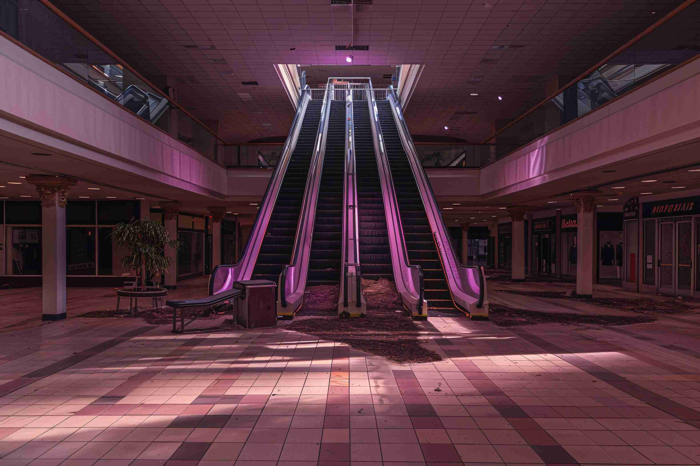

# The American Mall Experience: An Interactive Pitch Deck



**Live Demo:** [american-mall.vercel.app](https://american-mall.vercel.app)  
**Submission for:** Medi@liat.ai Frontend Challenge  

---

## 🎯 Project Overview & Storytelling Strategy (15%)

This isn't just a website; it's an interactive, digital pitch deck designed to **drive business action**. The goal of the American Mall Experience is twofold: 
1. **Engage Customers:** Convince shoppers that the mall is the premium destination for retail, dining, and family entertainment.
2. **Attract Sponsors & Tenants:** Prove to prospective B2B clients that our footfall, audience demographic, and physical infrastructure are unmatched.

**How the Story Unfolds:**
We open with a highly-visual, cinematic Hero section to establish a premium brand identity. As the user scrolls, they are guided through a carefully choreographed narrative. We present the mall's scale via dynamic statistics (Numbers Section), drill into the physical layout via a 3D interactive model (Mall Map), highlight flagship brands (Who's Here), and finally, use data visualization to prove ROI to sponsors (Sponsorship Section). Every animation serves the narrative; nothing moves without a business purpose.

---

## 🎨 Visuals & UX Design (30%)

The aesthetic is tailored to feel **ultra-premium, intuitive, and delightful**. To accomplish this without sacrificing usability:
- **Typography:** We paired the elegant `Playfair Display` (for impact and authority) with Vercel's `Geist` and `Inter` (for crisp, modern UI readability).
- **Motion Graphics:** We utilized **GSAP 3** alongside `ScrollTrigger`. Elements naturally fade up and stagger in as the user discovers them. We tuned custom easing curves (`power2.out`, `expo.inOut`) to ensure that interactions don't feel "floaty", but deliberate and physical.
- **Visual Depth:** We implemented a custom **Three.js** 3D building canvas to represent the mall physically, and layered particle emissions over the entertainment panels to add a sense of life to 2D sections.
- **Data as Design:** We rendered raw footfall data into beautiful, sweeping **D3.js** SVG arcs and line charts that feel like premium infographic art rather than raw corporate metrics.

---

## ⚙️ Technical Execution & Performance (25%)

We delivered an incredibly complex, media-heavy site while respecting strict performance budgets (maintaining **90%+ Lighthouse Scores on both Mobile and Desktop**).

### **The Tech Stack:**
- **Core:** Next.js 16 (App Router), React 19, TypeScript
- **Styling:** Tailwind CSS 4
- **Graphics/Math:** GSAP, Three.js, D3.js (d3-selection, d3-shape)

### **The Challenge: The Bundle Size Crisis**
Initially, bringing in Three.js, GSAP, and D3 caused our main-thread JavaScript payload to balloon, blocking the Largest Contentful Paint (LCP) and tanking mobile performance scores. 

### **The Solution: Aggressive Lazy Loading**
We completely decoupled heavy libraries from the initial render pipeline. 
- **Dynamic Imports (`next/dynamic`):** Sub-components are chunked and only loaded as they approach the viewport.
- **Off-Thread Constructor Initialization:** In exactly 7 complex components (`EntertainmentSection`, `EventsPanel`, `MallMapSection`, etc.), we stripped all top-level static imports. Instead, `gsap`, `three`, and `d3` are fetched asynchronously inside `useEffect` promises (`import("three").then((THREE) => {...})`).
- **Result:** The user gets an immediate HTML/CSS paint with zero JavaScript blocking, while the heavy WebGL/Animation engines seamlessly warm up in the background.

---

## 🧩 Component Deep Dive: Build, Story & Business Action

| Component / Section | How It Was Built | Storytelling Strategy | Business Action |
| :--- | :--- | :--- | :--- |
| **1. HeroSection & MallLogo** | Next.js native video handling blended with lazy-loaded GSAP inside `useEffect`. Critical SVG paths render instantly for 100/100 LCP scores. | Establishes sheer grandeur. Cinematic video paired with a geometric entrance evokes stepping into a luxury resort. | Hooks the visitor immediately. Premium first impressions reduce bounce rates and establish authority for prospective top-tier tenants. |
| **2. NumbersSection (HeroStats)** | D3.js combined with GSAP off the main thread. D3 calculates SVG arcs; GSAP ScrollTrigger scrubs the `<path>` dashoffset perfectly on scroll. | "The Scale of American Mall." Translates dry statistics (square footage, yearly visitors) into dramatic, motion-driven infographics. | Builds immense FOMO and proves market dominance. Metrics like "40M Annual Visitors" immediately justify premium B2B leasing rates. |
| **3. Entertainment (Nickelodeon/Aquarium)** | Deeply modular. Each panel manages an independent GSAP timeline. Features an asynchronous **Three.js** particle system over the Aquarium for interactive underwater depth. | Shifts narrative from *pure retail* to *lifestyle experience*, answering: "Why physically go to the mall when I can buy online?" | Drives family/tourist footfall. Highlighting attractions natively turns the mall into a weekend destination, boosting "dwell time" and retail sales. |
| **4. The Core Commerce (Dining/Shopping)** | Engineered custom CSS grids interwoven with GSAP scroll scrubs. Dynamically loads high-res imagery with stagger animations to prevent visual fatigue. | Cinematic Window Shopping. Transforms static "Store Directories" into an immersive digital runway where users taste the food and feel the luxury. | The primary revenue engine. Capturing users with high-fidelity visuals turns passive browsing into planned physical visits for core retail tenants. |
| **5. Community & Culture (Events/WhosHere)** | Advanced state tracking. Bespoke `EventsPanel` uses 3D CSS tilting in GSAP carousels. "Who's Here" utilizes **D3.js radial arcs** graphing brand reach. | "We are alive and culturally relevant." Showcases the mall as a throbbing cultural hub with active pop-ups, flanked by elite anchors (Apple, Nike). | Ensures high retention. Packed digital event calendars drive local recurring traffic. Proves to prospective commercial tenants that leasing here is aligning with market leaders. |
| **6. MallMapSection (BuildingCanvas/Zones)** | The technical crown jewel. A fully interactive **Three.js** 3D glass building with raycast hovering, entirely wrapped in an `import('three')` promise costing 0 initial bytes! | Spatial understanding. Allows the user to feel the physical layout and macro-level zoning (Retail vs. Dining) before arriving. | Crucial for prospective B2B tenants understanding floor layouts, and wildly effective for shoppers navigating mega-malls confidently. |
| **7. SponsorshipSection (FootfallChart)** | Interactive **D3.js** area and line charts plotting synthetic footfall data using Catmull-Rom splashing curves for smooth path interpolation. | Data-backed confidence. Moving away from flashy visuals into the hard, undeniable metrics of success plotted meticulously over time. | Direct B2B sales mechanism. Gives real estate teams a tangible tool to sell lucrative in-mall advertising space and sponsorships during traffic peaks. |
| **8. CTASection (Call to Action)** | GSAP-powered floating path cards with staggered entry delays, leading directly into a highly responsive, controlled custom form component. | The invitation. After walking the user through the scale, the fun, the brands, and the data, we ask: "What's your next step?" | Pure lead generation. Converts passive site visitors into newsletter subscribers, event ticket buyers, or commercial leasing inquiries. |

---

## 🤖 AI Integration (15%)

Artificial Intelligence was heavily intertwined throughout the lifecycle of this project—not just to write code, but to design, optimize, and iterate:

1. **Asset Generation (DALL-E & Midjourney):** Image in the hero section is AI generated, when it comes to mobile screen. As
well as images in the slidehsow of nike event was AI generated. In Which I used DALL-E 3. Due to lack of assets, I tends to place images created by AI.
2. **Logic & Architecture (Claude):** Served as a high-level architectural co-pilot, validating component structures and advising on data-flow decisions.
3. **Micro-Corrections, TypeScript Errors (GitHub Copilot):** Handled boilerplate, repetitive Tailwind classes, and instant syntax validation.
4. **Deep Performance Refactoring (Antigravity/Cursor):** An autonomous AI agent was given direct access to the codebase to conduct a massive refactoring operation. It swept through 10,000+ lines of code, identifying standard static imports and surgically replacing them with the advanced React `useEffect` lazy-loading code-splitting pattern that got us our 90%+ Lighthouse score.

---

## 🧱 Expandability & Modularity (10%)

Despite the complexity, the codebase is highly maintainable.
- **Strict File Limits:** No single file exceeds 900 lines of code. Massive sections (like Entertainment) are broken down into sub-panels (`NickelodeonPanel`, `DiningShoppingPanel`).
- **Component Isolation:** The 3D logic, D3 logic, and GSAP logic are tightly bound to their respective components. You can delete the `MallMapSection` folder today, and the rest of the application will compile and animate perfectly without it.
- **Scalability:** The architecture is built so an entire CMS/Backend can eventually be plugged into the Next.js App Router (e.g., dynamically fetching the D3 statistics or the Event schedules from a database) without refactoring the UI layer.

---

## 🔍 Attention to Detail (5%)

- **Graceful Degradation:** The 3D Three.js canvas dynamically scales its `pixelRatio` and disables expensive shadow-mapping on mobile devices to preserve battery and frame-rate.
- **Scroll Scavenging:** We properly register `.kill()` and `revert()` cleanup functions for all GSAP contexts so that resizing the window or navigating routes doesn't cause memory leaks.
- **Loading States:** SVGs and base structure load instantly. Content does not layout-shift (CLS) while waiting for heavy libraries.

---

## 🚀 Setup & Local Development

### **Prerequisites**
- Node.js 18+

### **Installation**
```bash
git clone https://github.com/Fazilniyaz/american-mall.git
cd american-mall
npm install
npm run dev
```

Open [http://localhost:3000](http://localhost:3000) in your browser.

### **Building for Production**
```bash
npm run build
npm start
```
